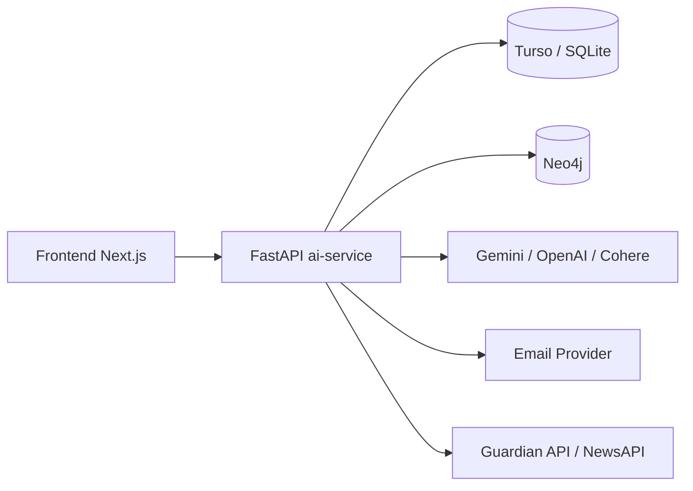
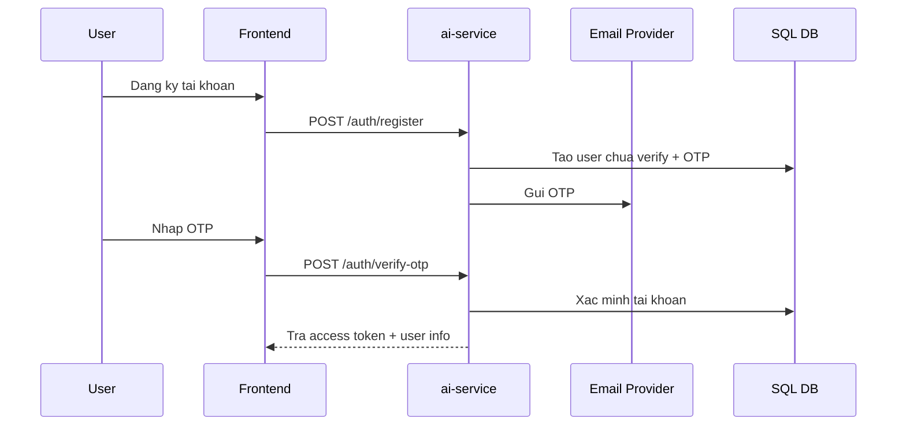
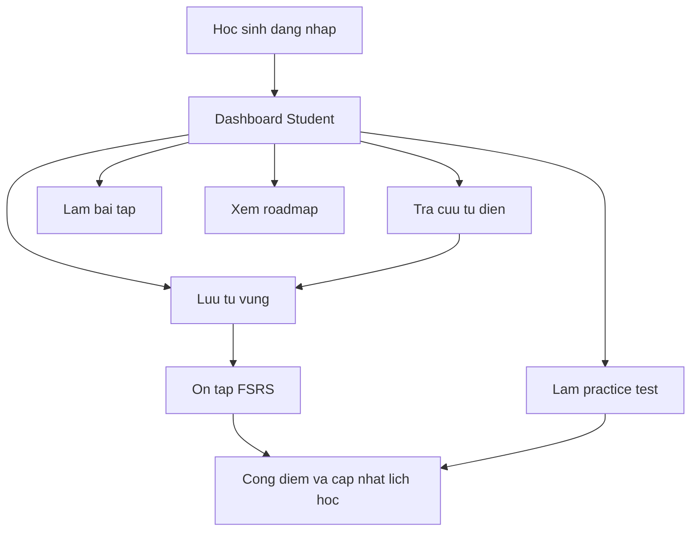
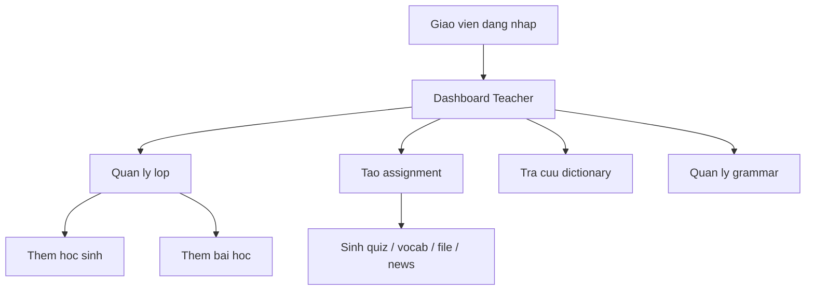

# BAO CAO BAN GIAO HE THONG NCKHTA

## 1. Muc dich tai lieu

Tai lieu nay mo ta he thong NCKHTA theo goc nhin van hanh thuc te:

- He thong dung de hoc tieng Anh ca nhan hoa, ket hop quan ly lop hoc va cac tinh nang AI.
- Muc tieu cua tai lieu la giup nguoi tiep quan co the hieu nhanh y tuong san pham, kien truc, luong du lieu, cac module chinh, cach chay he thong, va nhung diem can luu y khi bao tri.
- Trong repo hien tai co mot so tai lieu va module cu. Tai lieu nay uu tien mo ta theo phan dang chay thuc te, khong chi theo thiet ke ban dau.

## 2. Tong quan san pham

NCKHTA la mot nen tang hoc tieng Anh gom 3 vai tro chinh:

- Hoc sinh: hoc tu vung, luyen tap, lam bai tap, xem lo trinh hoc tap, tra cuu tu dien, su dung cong cu AI.
- Giao vien: quan ly lop, them hoc sinh vao lop, tao bai hoc, tao bai tap, sinh noi dung bang AI, lay ngu lieu tu tin tuc.
- Quan tri vien: quan ly nguoi dung, lop, bai hoc, bai tap, cau hinh he thong, theo doi AI logs va thong ke toan he thong.

Gia tri cot loi cua he thong:

- Ca nhan hoa hoc tap bang AI.
- Tra cuu tu vung nang cao, ket hop dictionary + AI + knowledge graph.
- On tap tu vung theo co che spaced repetition FSRS.
- Ho tro giao vien tao hoc lieu nhanh tu van ban, tep tin, va tin tuc.

## 3. Kien truc tong the

### 3.1 Kien truc thuc te dang van hanh

He thong hien tai van hanh chu yeu theo mo hinh sau:

Thanh phan va vai tro:

- `frontend/`: giao dien nguoi dung, viet bang Next.js 14.
- `ai-service/`: backend chinh, viet bang FastAPI, chua phan lon business logic, auth, AI, data access va graph integration.
- `Turso / SQLite`: co so du lieu quan he chinh dang duoc `ai-service` su dung.
- `Neo4j`: phuc vu knowledge graph, mot phan cache/quan he tu vung va grammar.
- `Gemini / OpenAI / Cohere`: cac nha cung cap AI de sinh noi dung, bo sung dictionary, rerank ket qua va du phong khi mot provider loi.
- `backend-core/`: Spring Boot service ton tai trong repo, nhung chi phu trach phan score API muc nho, khong phai trung tam van hanh cua he thong hien tai.

### 3.2 Nhung dieu can hieu dung ngay tu dau

1. He thong-of-record hien tai la `ai-service`, khong phai `backend-core`.
2. Schema du lieu thuc te dang chay nam trong `ai-service/app/database.py`, khong phai trong `database/schema.sql`.
3. Mot phan tai lieu goc trong repo con phan anh kien truc cu, trong do co nhac toi Postgres hoac GraphRAG, nhung van hanh thuc te hien tai tap trung vao FastAPI + Turso/SQLite + Neo4j + cac AI provider.

## 4. Cau truc thu muc va trach nhiem tung phan

### 4.1 `frontend/`

Frontend la giao dien chinh cho ca 3 vai tro:

- Quan ly dang nhap, token va thong tin nguoi dung trong `app/context/AuthContext.tsx`.
- Dieu huong dashboard theo role trong `app/dashboard/layout.tsx`.
- Student dashboard gom cac tab cho thong ke, tu dien, tu vung, bai tap, AI tools, grammar, roadmap, ranking.
- Teacher dashboard gom cac man quan ly lop, bai hoc, bai tap va AI tools.
- Admin dashboard gom quan ly nguoi dung, lop, bai hoc, tu vung, grammar, settings, assignments, AI monitoring.

Frontend khong xu ly business logic phuc tap. Vai tro cua no la:

- Goi API den `ai-service`.
- Parse ket qua streaming o mot so tinh nang AI.
- Hien thi du lieu, thong ke, danh sach va form thao tac.

### 4.2 `ai-service/`

Day la thanh phan quan trong nhat cua he thong.

Chuc nang chinh:

- Khoi tao app, middleware, CORS, health checks.
- Xac thuc JWT, OTP, forgot/reset password.
- Quan ly user, lop, bai hoc, bai tap, diem so, tu vung, lo trinh hoc tap.
- Dieu phoi AI cho dictionary, quiz, practice, writing feedback, speaking topic, roadmap.
- Tich hop Neo4j cho graph relations.
- Ghi log va theo doi tinh trang AI providers.

Cac nhom file quan trong:

- `app/main.py`: diem vao FastAPI, middleware, include routers, health checks.
- `app/database.py`: ket noi DB, migration, schema runtime, seed data, settings va cache DB.
- `app/dependencies.py`: lay current user theo JWT, phan quyen theo role.
- `app/routers/auth.py`: dang ky, OTP, login, profile, logout, reset password.
- `app/routers/student.py`: luong nghiep vu hoc sinh.
- `app/routers/teacher.py`: luong nghiep vu giao vien.
- `app/routers/admin.py`: luong nghiep vu quan tri.
- `app/services/llm_service.py`: xu ly AI, fallback providers, caching, rerank, dictionary enrichment.
- `app/services/graph_service.py`: ket noi va truy van Neo4j.
- `app/services/file_service.py`: trich xuat text tu txt, md, csv, pdf, docx.
- `app/services/auth_service.py`: hash password, JWT, email OTP, reset token.
- `app/services/news_service.py`: lay ngu lieu tu Guardian va NewsAPI.

### 4.3 `backend-core/`

Module nay la Spring Boot service nho:

- Hien tai tap trung quanh `ScoreController`, `Score`, `ScoreRepository`.
- Co cau hinh Spring Security nhung thuc te van `permitAll()` cho moi endpoint.
- Chua thay su tich hop ro rang vao luong van hanh chinh cua frontend hien tai.

Ket luan ban giao:

- Khong nen xem `backend-core` la backend chinh cua san pham.
- Neu tiep tuc phat trien, can quyet dinh ro se bo module nay, giu lai cho 1 nghiep vu rieng, hay hop nhat vao `ai-service`.

### 4.4 `database/`

Thu muc nay chua SQL va Cypher scripts goc. Gia tri chinh cua no la tai lieu lich su va khoi tao ban dau.

Can luu y:

- `database/schema.sql` khong con day du so voi schema runtime thuc te.
- `database/graph_schema.cypher` cung nghieng ve khoi tao ban dau, khong phan anh toan bo cach `graph_service.py` dang hoat dong.

## 5. Luong khoi dong he thong

### 5.1 Luong startup cua `ai-service`

Khi `ai-service` chay:

1. Nap `.env` truoc khi import services.
2. Import `graph_service`, `llm_service`, sau do import cac router.
3. Trong lifespan startup:
   - Goi `init_db()` de tao/migrate schema.
   - Kiem tra `SECRET_KEY`.
   - Thu warm-up ket noi Neo4j.
4. Cau hinh middleware:
   - Security headers.
   - Global exception handler.
   - Request timeout.
   - Rate limit cho cac route nang ve AI/dictionary.
5. Include routers theo role:
   - `/auth`
   - `/admin`
   - `/teacher`
   - `/student`
6. Bat CORS cho cac origin duoc khai bao va localhost.

### 5.2 Health va kha nang tu phuc hoi

He thong co cac co che giam loi co ban:

- `GET /health` kiem tra SQL DB va Neo4j.
- Global exception handler tra loi 500 va log ra console.
- Timeout middleware tranh request treo qua lau.
- Rate limiter giam nguy co spam cac route AI nang.
- Database connection co retry va fallback local khi khong bat `ONLINE_DB_ONLY`.

## 6. Co so du lieu thuc te dang chay

## 6.1 Nguon su that ve schema

Schema runtime thuc te duoc tao va migrate trong `ai-service/app/database.py`.

Bang chinh dang duoc su dung:

- `users`
- `revoked_tokens`
- `classes`
- `lessons`
- `settings`
- `dictionary_cache`
- `generated_exams`
- `grammar_rules`
- `enrollments`
- `assignments`
- `student_scores`
- `saved_vocabulary`
- `study_logs`
- `student_roadmaps`
- `ai_logs`
- `provider_status`
- `user_usage` (duoc tao khi can trong router student)

### 6.2 Y nghia nghiep vu cua cac bang

`users`

- Chua tai khoan, role, password hash, trang thai xac minh, AI credits, points, muc tieu hoc tap.

`revoked_tokens`

- Danh sach JWT da logout hoac bi vo hieu hoa.

`classes`

- Thong tin lop hoc do giao vien hoac admin tao.

`lessons`

- Noi dung bai hoc gan voi lop.

`settings`

- Luu cau hinh he thong trong DB, bao gom key cho AI, email, Neo4j va cac tham so runtime.

`dictionary_cache`

- Cache ket qua tra cuu tu dien de giam goi AI lap lai.

`generated_exams`

- Luu lich su de thi/luyen tap da sinh ra cho hoc sinh.

`grammar_rules`

- Danh sach chu de ngu phap va tep dinh kem.

`enrollments`

- Quan he hoc sinh - lop.

`assignments`

- Bai tap giao vien/admin tao cho lop hoc.

`student_scores`

- Diem so bai tap cua hoc sinh.

`saved_vocabulary`

- Tu vung da luu cua hoc sinh, dong thoi chua cac truong phuc vu FSRS nhu `stability`, `difficulty`, `retrievability`, `scheduled_at`, `reps`, `lapses`.

`study_logs`

- Nhat ky moi lan hoc sinh on tap tu vung.

`student_roadmaps`

- Cache lo trinh hoc tap ca nhan hoa.

`ai_logs`

- Log request AI de admin theo doi.

`provider_status`

- Ghi nhan nha cung cap AI dang loi tam thoi, phuc vu fallback.

`user_usage`

- Gioi han so lan dung mot so tinh nang theo ngay.

### 6.3 Seed data mac dinh

Neu bang `classes` rong khi khoi tao DB, he thong seed du lieu mau:

- `admin@eam.edu.vn`
- `lan.nguyen@eam.edu.vn`
- `huytran123@gmail.com`

Mat khau mac dinh duoc seed la `123456`.

Canh bao ban giao:

- Day la thong tin phuc vu phat trien/demo.
- Neu dua he thong vao moi truong that, can thay doi ngay mat khau seed hoac tat seed demo.

## 7. Co che xac thuc va phan quyen

### 7.1 Mo hinh auth

He thong dung JWT qua `auth_service.py`.

- Token chua `sub`, `email`, `exp`, `iat`, `jti`.
- Han token mac dinh la 30 ngay.
- Logout khong chi xoa token o frontend ma con ghi `jti` vao `revoked_tokens`.
- Router duoc bao ve bang dependencies:
  - admin: `get_admin_user`
  - teacher: `get_teacher_user`
  - student: `get_current_user`

### 7.2 Luong dang ky va kich hoat

### 7.3 Email va OTP

He thong gui mail qua nhieu kenh du phong:

- Brevo
- Resend
- SMTP

Provider duoc lay tu `settings` va env. Dieu nay giup van hanh linh hoat tren cloud, dac biet khi SMTP bi chan.

### 7.4 Diem can luu y

- Neu `SECRET_KEY` khong duoc cau hinh, he thong tu tao key tam thoi. Khi restart service, cac session cu se khong con hop le.
- Frontend luu token trong `localStorage` qua `AuthContext.tsx`.
- `AuthContext` tu them Bearer token cho request va logout khi gap `401`.

## 8. Luong nghiep vu theo vai tro

## 8.1 Hoc sinh

Day la luong phong phu nhat cua he thong.

Chuc nang chinh:

- Xem thong ke hoc tap.
- Xem xep hang theo diem.
- Tra cuu tu dien AI.
- Luu tu vung ca nhan.
- On tap tu vung theo FSRS.
- Lam practice test.
- Lam assignment dang quiz va writing.
- Xem diem.
- Xem lo trinh hoc tap ca nhan hoa.
- Dung cac cong cu AI: IPA, reading, writing, speaking, file analysis.

Luong tong quat:

#### 8.1.1 Tra cuu tu dien

Frontend student goi `/student/dictionary/lookup`.

Luoc do xu ly:

1. Frontend gui tu can tra.
2. Backend kiem tra cache memory.
3. Neu khong co, kiem tra `dictionary_cache` trong DB.
4. Neu du lieu thieu hoac khong co:
   - Lay nghia co ban tu free dictionary source.
   - Goi AI de bo sung nghia Anh, nghia Viet, vi du, collocations, idioms, muc CEFR, phonetics.
   - Co the bo sung thong tin tu Wikipedia.
   - Lay quan he tu trong Neo4j.
   - Rerank ket qua bang Cohere khi phu hop.
5. Chi cache khi du lieu du "complete enough".
6. Stream ket qua ve frontend de hien thi tung phan.
7. Hoc sinh co the luu tu vao `saved_vocabulary`.

Ket qua dictionary la mot trong nhung gia tri lon nhat cua he thong vi no khong chi la tu dien, ma la mot pipeline tong hop:

- Dictionary raw data
- AI enrichment
- Graph relation
- Cache
- Streaming UX

#### 8.1.2 On tap tu vung theo FSRS

Router student co mot implementation FSRS don gian hoa.

Luong:

1. Hoc sinh luu tu vao `saved_vocabulary`.
2. Khi bat dau practice, he thong chon:
   - Tu chua hoc bao gio.
   - Hoac tu da den lich `scheduled_at`.
3. AI sinh cau hoi on tap.
4. Hoc sinh nop ket qua.
5. Backend cap nhat:
   - `stability`
   - `difficulty`
   - `retrievability`
   - `scheduled_at`
   - `reps`
   - `lapses`
6. Ghi `study_logs`.
7. Cong diem cho hoc sinh.

Tac dung:

- Day la co che lap lich on tap trung tam cho trai nghiem hoc tu vung ca nhan hoa.
- Neu can chuyen giao cho nguoi moi, day la phan nen doc ky trong `student.py`.

#### 8.1.3 Practice test va exam history

Hoc sinh co the sinh de luyen tap AI va luu lich su.

Luong:

1. Frontend goi route sinh practice.
2. AI tao de.
3. Hoc sinh nop diem.
4. Backend luu vao `generated_exams`.
5. Cong points theo ty le diem dat duoc.

#### 8.1.4 Assignment

Hoc sinh xem assignment cua lop va nop bai.

He thong ho tro it nhat 2 kieu:

- Quiz
- Writing

Sau khi nop:

- Ket qua duoc luu vao `student_scores`.
- Hoc sinh co the xem lai diem.

#### 8.1.5 Roadmap ca nhan hoa

Route `/student/roadmap` tao lo trinh hoc tap bang AI.

He thong khong sinh lai moi lan, ma dung cache trong `student_roadmaps`.

Co che invalidation:

- Tao `stats_hash` dua tren tong so tu vung va diem.
- Roadmap duoc sinh lai khi:
  - Tang them moi 20 tu.
  - Hoac tang them moi 500 diem.

Day la cach can bang giua chi phi AI va tinh ca nhan hoa.

#### 8.1.6 AI tools cho hoc sinh

Mot so route AI tinh phi 5 credits moi lan thanh cong:

- `/student/analyze-text`
- `/student/ipa/generate`
- `/student/practice/generate`
- `/student/reading/generate`
- `/student/writing/evaluate`
- `/student/speaking/topic`
- `/student/file/upload-analyze`
- mot so route practice/grammar khac

Nguyen tac chung:

- Kiem tra `credits_ai` truoc.
- Thu hien sinh noi dung.
- Tru credits khi request thanh cong.

## 8.2 Giao vien

Vai tro cua giao vien la quan ly hoc lieu va hoc sinh trong lop.

Chuc nang chinh:

- Quan ly lop cua minh.
- Them hoc sinh vao lop.
- Quan ly bai hoc.
- Tao assignment.
- Dung AI de sinh quiz, sinh tu vung, sinh assignment tu file, sinh assignment tu tin tuc.
- Tra cuu dictionary va xem knowledge graph.
- Quan ly grammar rules.

Luong tong quat:

#### 8.2.1 Quan ly lop

Teacher co the:

- Tao, sua, xoa lop cua minh.
- Xem danh sach hoc sinh trong lop.
- Lay danh sach hoc sinh co san de enroll vao lop.
- Xem bai hoc va bai tap cua lop.

#### 8.2.2 Tao hoc lieu bang AI

Teacher co cac route chinh:

- `/teacher/generate-quiz`
- `/teacher/generate-vocab`
- `/teacher/file/generate-assignment`
- `/teacher/news/topics`
- `/teacher/news/generate-assignment`
- `/teacher/dictionary/lookup`
- `/teacher/knowledge-graph`

Co che tinh credits tuong tu student:

- Nhieu route teacher tru 5 AI credits cho moi lan tao noi dung.

#### 8.2.3 News-based assignment

Teacher co the lay topic tin tuc tu `news_service.py`.

Luong:

1. Goi Guardian API truoc.
2. Neu can thi fallback sang NewsAPI.
3. Chon bai co noi dung du dai.
4. Dua ngu lieu do vao pipeline AI de sinh reading assignment.

Day la tinh nang hay de trinh bay y tuong "hoc tren ngu lieu thoi su".

## 8.3 Quan tri vien

Admin co vai tro quan ly he thong va van hanh.

Chuc nang chinh:

- Xem thong ke tong quan.
- Quan ly nguoi dung.
- Cap nhat credits hang loat.
- Quan ly lop va bai hoc.
- Quan ly tu vung.
- Quan ly grammar.
- Quan ly settings.
- Test email va test Neo4j.
- Quan ly assignments.
- Theo doi AI logs va AI stats.

Admin la nguoi co kha nang chan doan he thong tot nhat tu giao dien.

Luot danh muc can biet:

- `AI Logs`: xem request nao dang loi, provider nao dang dung, do tre ra sao.
- `Settings`: noi tap trung cho API keys, SMTP, Neo4j, v.v.
- `Test Email`, `Test Neo4j`: dung de kiem tra cau hinh sau khi deploy.

## 9. Pipeline AI va cach xu ly thong minh

## 9.1 `llm_service.py` la trung tam AI

Day la file quan trong nhat neu muon hieu "tri tue" cua he thong.

No phu trach:

- Chon provider AI.
- Fallback khi provider loi.
- Kiem soat so request dong thoi bang semaphore.
- Sua JSON loi va lam sach response.
- Ghi log request AI.
- Rerank ket qua dictionary.
- Sinh cac dang noi dung hoc tap.

### 9.2 Chien luoc fallback provider

He thong ho tro it nhat:

- Gemini
- OpenAI
- Cohere

Co che tong quat:

1. Thu provider uu tien.
2. Neu loi, danh dau provider fail vao `provider_status`.
3. Chuyen sang provider tiep theo.
4. Log lai qua trinh de admin co the kiem tra.

Muc tieu:

- Giam xac suat he thong "chet AI" khi 1 nha cung cap gap van de.

### 9.3 Caching

Caching duoc dung o nhieu tang:

- Memory cache trong process.
- DB cache `dictionary_cache`.
- Roadmap cache trong `student_roadmaps`.
- Neo4j co the luu mot so du lieu graph/dictionary phuc vu truy van nhanh hon.

### 9.4 Gioi han tai

`llm_service.py` dung `asyncio.Semaphore(15)` de gioi han so request AI dong thoi.

Y nghia:

- Bao ve he thong khoi bi qua tai.
- Giu on dinh cho local va production.

### 9.5 Logging va quan sat

Moi request AI quan trong nen duoc ghi vao `ai_logs`.

Admin co the xem:

- route nao duoc dung nhieu
- request nao loi
- provider nao khong on dinh
- xu huong su dung AI

## 10. Knowledge Graph va vai tro cua Neo4j

Neo4j khong phai he thong record chinh, nhung la thanh phan tao ra khac biet cho san pham.

Vai tro thuc te:

- Luu node/quan he tu vung.
- Luu va khai thac ket noi giua cac tu.
- Phuc vu visualize knowledge graph.
- Luu mot phan grammar theo dang graph.
- Ho tro cache/bo sung dictionary trong mot so truong hop.

Neu Neo4j mat ket noi:

- He thong van co the chay o muc "degraded" cho nhieu chuc nang.
- Nhung phan graph visualization va mot so enrichment se giam chat luong hoac khong co.

## 11. Frontend va cach van hanh giao dien

### 11.1 AuthContext

`frontend/app/context/AuthContext.tsx` la diem trung tam phia client:

- Luu `eam_token` va `eam_user` trong `localStorage`.
- Cung cap `authFetch` de tu dong them Authorization header.
- Tu dong logout khi token het han hoac backend tra `401`.
- Dong bo logout giua cac tab bang `eam_logout_trigger`.

### 11.2 Dashboard role-based

Sau dang nhap:

- Student thay dashboard hoc tap.
- Teacher thay dashboard quan ly lop va AI tools.
- Admin thay dashboard van hanh he thong.

### 11.3 Streaming UX

Mot so tinh nang nhu dictionary su dung kieu response streaming.

Frontend co nhiem vu:

- Nhan chunk.
- Parse tung phan.
- Cap nhat UI theo tien trinh.

Day la diem giup trai nghiem AI tu nhien hon so voi cho response mot lan.

## 12. Cach chay he thong

## 12.1 Chay local theo thuc te hien tai

Huong dan local trong repo hien tai uu tien:

1. Chay `ai-service`.
2. Bat `ONLINE_DB_ONLY=1` neu muon ep dung Turso.
3. Chay frontend Next.js.
4. Dat `NEXT_PUBLIC_API_URL` tro vao `http://localhost:8000` hoac `http://127.0.0.1:8000`.

Co the hieu ngan gon:

- Backend chinh: `ai-service`
- Frontend: `frontend`
- `backend-core` khong phai bat buoc cho luong chinh dang duoc su dung

### 12.2 Deploy

Theo cau truc hien tai:

- `ai-service` co the deploy len Render.
- `frontend` co the deploy len Vercel.
- `backend-core` cung co trong `render.yaml`, nhung can xem lai co con can dung khong.

### 12.3 Bien moi truong quan trong

Nhom can co:

- DB:
  - `TURSO_URL`
  - `TURSO_AUTH_TOKEN`
  - `ONLINE_DB_ONLY`
  - `FORCE_LOCAL_DB`
- Auth:
  - `SECRET_KEY`
- Neo4j:
  - URI, username, password thong qua env hoac `settings`
- AI:
  - Gemini key
  - OpenAI key
  - Cohere key
- Email:
  - Brevo, Resend, hoac SMTP settings
- Frontend:
  - `NEXT_PUBLIC_API_URL`

Neu ban giao cho nguoi moi, phan environment la phan can checklist ro rang nhat vi he thong phu thuoc vao nhieu dich vu ngoai.

## 13. Thuc trang he thong va nhung diem lech can luu y

Day la phan rat quan trong khi ban giao.

### 13.1 `ai-service` moi la backend trung tam

Tai lieu goc cua repo co nhac den `backend-core` nhu backend quan ly user/progress, nhung thuc te hien tai:

- Auth
- Role-based API
- Lop hoc
- Bai hoc
- Bai tap
- Tu vung
- Roadmap
- AI
- Settings

deu nam trong `ai-service`.

### 13.2 `backend-core` dang o trang thai phu tro, chua hoan tat security

`backend-core/src/main/java/com/example/eam/config/SecurityConfig.java` hien tai:

- Permit public cho `/api/scores/**`
- Va `anyRequest().permitAll()`
- Comment trong code thua nhan JWT filter chua duoc lam xong

Ket luan:

- Khong nen dua module nay vao production voi ky vong no dang duoc bao ve day du.
- Neu tiep quan he thong, can quyet dinh co tiep tuc duy tri module nay hay khong.

### 13.3 Tai lieu schema cu da lech so voi runtime

`database/schema.sql` va `database/graph_schema.cypher` khong con la nguon dung nhat de hieu du lieu hien tai.

Nguon dung can doc la:

- `ai-service/app/database.py`

### 13.4 Frontend teacher con goi mot so endpoint cu

Trong `frontend/app/dashboard/teacher/AIToolsTab.tsx`, frontend van goi mot so route cu nhu:

- `/teacher/ai/extract-vocab`
- `/teacher/ai/extract-vocab-file`
- `/teacher/ai/generate-quiz`
- `/teacher/dictionary/search`
- `/teacher/ai/knowledge-graph`

Trong khi backend hien tai dang expose:

- `/teacher/generate-vocab`
- `/teacher/file/generate-assignment`
- `/teacher/generate-quiz`
- `/teacher/dictionary/lookup`
- `/teacher/knowledge-graph`

Y nghia ban giao:

- Teacher AI Tools co nguy co loi giao tiep frontend-backend neu chua duoc dong bo.
- Nguoi tiep quan nen uu tien ra soat endpoint mapping o khu vuc nay.

### 13.5 Mot so chi tiet ky thuat trong AI service can xem lai

Qua ra soat ma nguon, co it nhat cac diem sau can duoc danh dau:

- `llm_service.py` dung semaphore 15 slots, nhung `get_queue_status()` lai tinh tren moc 7, khien thong tin queue tren UI co the sai.
- File `llm_service.py` co dau hieu chua het code cu/thu nghiem, can test ky cac luong sinh reading/practice truoc khi mo rong.
- Repo con nhieu file phu tro, script chan doan va artifact local, nen can tach ro "core" va "non-core" khi tiep quan.

### 13.6 Seed account va du lieu demo

Co tai khoan demo seed san. Dieu nay huu ich cho demo, nhung la rui ro neu deploy that ma khong doi password.

## 14. Thu tu khuyen nghi de doc khi tiep quan

Neu mot ky su moi vao du an, nen doc theo thu tu nay:

1. `README.md`
2. `HUONG_DAN_LOCALHOST.md`
3. `frontend/app/context/AuthContext.tsx`
4. `ai-service/app/main.py`
5. `ai-service/app/database.py`
6. `ai-service/app/routers/auth.py`
7. `ai-service/app/routers/student.py`
8. `ai-service/app/routers/teacher.py`
9. `ai-service/app/routers/admin.py`
10. `ai-service/app/services/llm_service.py`
11. `ai-service/app/services/graph_service.py`
12. `frontend/app/dashboard/student/*`
13. `frontend/app/dashboard/teacher/*`
14. `frontend/app/dashboard/admin/page.tsx`

Neu chi can hieu he thong nhanh de van hanh:

- Doc `database.py`, `main.py`, `auth.py`, `student.py`, `teacher.py`, `admin.py`, `AuthContext.tsx`.

Neu can debug AI:

- Tap trung vao `llm_service.py`, `graph_service.py`, `admin AI logs`, `settings`.

## 15. Checklist ban giao van hanh

Nguoi nhan ban giao can duoc xac nhan cac muc sau:

- Biet backend chinh la `ai-service`.
- Biet frontend dang tro vao API nao.
- Co day du `.env` hoac DB `settings`.
- Co Turso credentials hop le.
- Co Neo4j credentials hop le.
- Co it nhat 1 AI provider key hoat dong.
- Co email provider hoat dong neu can dang ky/OTP.
- Hieu seed accounts va da doi mat khau neu can.
- Biet cach kiem tra `/health`.
- Biet vao trang admin de xem `AI Logs`, `Settings`, `Test Email`, `Test Neo4j`.
- Biet teacher AI tools hien co endpoint mismatch can ra soat.

## 16. Danh gia tong ket

Ve mat y tuong, he thong co 3 lop gia tri ro rang:

- Nen tang hoc tieng Anh co role-based management.
- Lop AI tao noi dung va phan tich hoc tap.
- Lop knowledge graph va FSRS tao tinh ca nhan hoa va khac biet.

Ve mat ky thuat, he thong da co mot "xuong song" van hanh kha day du:

- Frontend da co dashboard theo vai tro.
- FastAPI da gom phan lon nghiep vu.
- SQL DB va Neo4j da duoc tich hop.
- AI pipeline da co fallback, cache va logging.

Tuy nhien, de ban giao an toan cho nguoi moi, can noi ro:

- Repo con dau vet cua kien truc cu.
- Tai lieu schema cu khong con day du.
- Teacher frontend chua dong bo het voi backend.
- `backend-core` chua nen xem la san sang production.

Neu nguoi nhan ban giao nam duoc 4 tru cot sau thi co the tiep quan he thong hieu qua:

1. `ai-service` la trung tam.
2. `database.py` la schema runtime that.
3. `llm_service.py` la trung tam AI.
4. Frontend role-based chi la lop giao tiep, business logic nam o backend.

