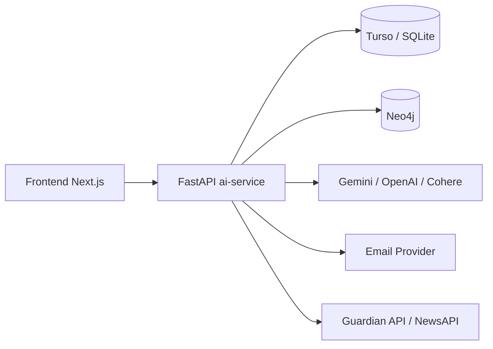
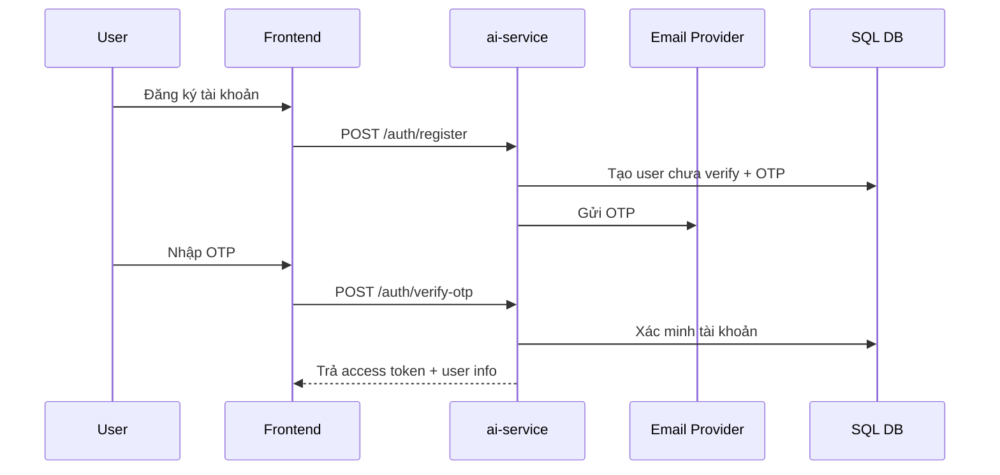
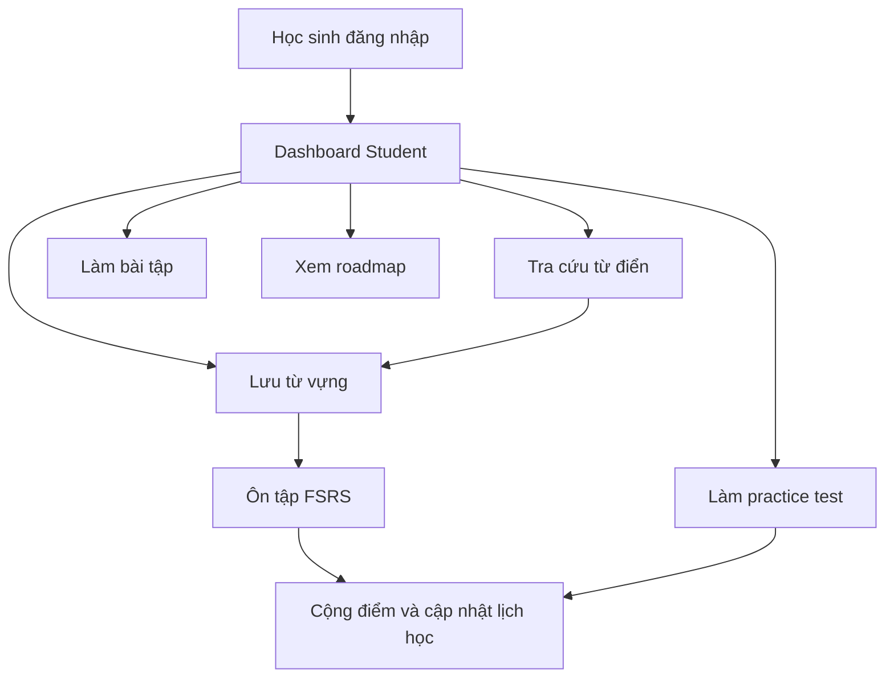

# BÁO CÁO BÀN GIAO HỆ THỐNG NCKHTA

## 1. Mục đích tài liệu

Tài liệu này mô tả hệ thống NCKHTA theo góc nhìn vận hành thực tế:

- Hệ thống dùng để học tiếng Anh cá nhân hóa, kết hợp quản lý lớp học và các tính năng AI.
- Mục tiêu của tài liệu là giúp người tiếp quản có thể hiểu nhanh ý tưởng sản phẩm, kiến trúc, luồng dữ liệu, các module chính, cách chạy hệ thống, và những điểm cần lưu ý khi bảo trì.
- Trong repo hiện tại có một số tài liệu và module cũ. Tài liệu này ưu tiên mô tả theo phần đang chạy thực tế, không chỉ theo thiết kế ban đầu.

## 2. Tổng quan sản phẩm

NCKHTA là một nền tảng học tiếng Anh gồm 3 vai trò chính:

- Học sinh: học từ vựng, luyện tập, làm bài tập, xem lộ trình học tập, tra cứu từ điển, sử dụng công cụ AI.
- Giáo viên: quản lý lớp, thêm học sinh vào lớp, tạo bài học, tạo bài tập, sinh nội dung bằng AI, lấy ngữ liệu từ tin tức.
- Quản trị viên: quản lý người dùng, lớp, bài học, bài tập, cấu hình hệ thống, theo dõi AI logs và thống kê toàn hệ thống.

Giá trị cốt lõi của hệ thống:

- Cá nhân hóa học tập bằng AI.
- Tra cứu từ vựng nâng cao, kết hợp dictionary + AI + knowledge graph.
- Ôn tập từ vựng theo cơ chế spaced repetition FSRS.
- Hỗ trợ giáo viên tạo học liệu nhanh từ văn bản, tệp tin, và tin tức.

## 3. Kiến trúc tổng thể

### 3.1 Kiến trúc thực tế đang vận hành

Hệ thống hiện tại vận hành chủ yếu theo mô hình sau:

Thành phần và vai trò:

- `frontend/`: giao diện người dùng, viết bằng Next.js 14.
- `ai-service/`: backend chính, viết bằng FastAPI, chứa phần lớn business logic, auth, AI, data access và graph integration.
- `Turso / SQLite`: cơ sở dữ liệu quan hệ chính đang được `ai-service` sử dụng.
- `Neo4j`: phục vụ knowledge graph, một phần cache/quan hệ từ vựng và grammar.
- `Gemini / OpenAI / Cohere`: các nhà cung cấp AI để sinh nội dung, bổ sung dictionary, rerank kết quả và dự phòng khi một provider lỗi.
- `backend-core/`: Spring Boot service tồn tại trong repo, nhưng chỉ phụ trách phần score API mức nhỏ, không phải trung tâm vận hành của hệ thống hiện tại.

### 3.2 Những điều cần hiểu đúng ngay từ đầu

1. Hệ thống-of-record hiện tại là `ai-service`, không phải `backend-core`.
2. Schema dữ liệu thực tế đang chạy nằm trong `ai-service/app/database.py`, không phải trong `database/schema.sql`.
3. Một phần tài liệu gốc trong repo còn phản ánh kiến trúc cũ, trong đó có nhắc tới Postgres hoặc GraphRAG, nhưng vận hành thực tế hiện tại tập trung vào FastAPI + Turso/SQLite + Neo4j + các AI provider.

## 4. Cấu trúc thư mục và trách nhiệm từng phần

### 4.1 `frontend/`

Frontend là giao diện chính cho cả 3 vai trò:

- Quản lý đăng nhập, token và thông tin người dùng trong `app/context/AuthContext.tsx`.
- Điều hướng dashboard theo role trong `app/dashboard/layout.tsx`.
- Student dashboard gồm các tab cho thống kê, từ điển, từ vựng, bài tập, AI tools, grammar, roadmap, ranking.
- Teacher dashboard gồm các màn quản lý lớp, bài học, bài tập và AI tools.
- Admin dashboard gồm quản lý người dùng, lớp, bài học, từ vựng, grammar, settings, assignments, AI monitoring.

Frontend không xử lý business logic phức tạp. Vai trò của nó là:

- Gọi API đến `ai-service`.
- Parse kết quả streaming ở một số tính năng AI.
- Hiển thị dữ liệu, thống kê, danh sách và form thao tác.

### 4.2 `ai-service/`

Đây là thành phần quan trọng nhất của hệ thống.

Chức năng chính:

- Khởi tạo app, middleware, CORS, health checks.
- Xác thực JWT, OTP, forgot/reset password.
- Quản lý user, lớp, bài học, bài tập, điểm số, từ vựng, lộ trình học tập.
- Điều phối AI cho dictionary, quiz, practice, writing feedback, speaking topic, roadmap.
- Tích hợp Neo4j cho graph relations.
- Ghi log và theo dõi tình trạng AI providers.

Các nhóm file quan trọng:

- `app/main.py`: điểm vào FastAPI, middleware, include routers, health checks.
- `app/database.py`: kết nối DB, migration, schema runtime, seed data, settings và cache DB.
- `app/dependencies.py`: lấy current user theo JWT, phân quyền theo role.
- `app/routers/auth.py`: đăng ký, OTP, login, profile, logout, reset password.
- `app/routers/student.py`: luồng nghiệp vụ học sinh.
- `app/routers/teacher.py`: luồng nghiệp vụ giáo viên.
- `app/routers/admin.py`: luồng nghiệp vụ quản trị.
- `app/services/llm_service.py`: xử lý AI, fallback providers, caching, rerank, dictionary enrichment.
- `app/services/graph_service.py`: kết nối và truy vấn Neo4j.
- `app/services/file_service.py`: trích xuất text từ txt, md, csv, pdf, docx.
- `app/services/auth_service.py`: hash password, JWT, email OTP, reset token.
- `app/services/news_service.py`: lấy ngữ liệu từ Guardian và NewsAPI.

### 4.3 `backend-core/`

Module này là Spring Boot service nhỏ:

- Hiện tại tập trung quanh `ScoreController`, `Score`, `ScoreRepository`.
- Có cấu hình Spring Security nhưng thực tế vẫn `permitAll()` cho mọi endpoint.
- Chưa thấy sự tích hợp rõ ràng vào luồng vận hành chính của frontend hiện tại.

Kết luận bàn giao:

- Không nên xem `backend-core` là backend chính của sản phẩm.
- Nếu tiếp tục phát triển, cần quyết định rõ sẽ bỏ module này, giữ lại cho 1 nghiệp vụ riêng, hay hợp nhất vào `ai-service`.

### 4.4 `database/`

Thư mục này chứa SQL và Cypher scripts gốc. Giá trị chính của nó là tài liệu lịch sử và khởi tạo ban đầu.

Cần lưu ý:

- `database/schema.sql` không còn đầy đủ so với schema runtime thực tế.
- `database/graph_schema.cypher` cũng nghiêng về khởi tạo ban đầu, không phản ánh toàn bộ cách `graph_service.py` đang hoạt động.

## 5. Luồng khởi động hệ thống

### 5.1 Luồng startup của `ai-service`

Khi `ai-service` chạy:

1. Nạp `.env` trước khi import services.
2. Import `graph_service`, `llm_service`, sau đó import các router.
3. Trong lifespan startup:
   - Gọi `init_db()` để tạo/migrate schema.
   - Kiểm tra `SECRET_KEY`.
   - Thử warm-up kết nối Neo4j.
4. Cấu hình middleware:
   - Security headers.
   - Global exception handler.
   - Request timeout.
   - Rate limit cho các route nặng về AI/dictionary.
5. Include routers theo role:
   - `/auth`
   - `/admin`
   - `/teacher`
   - `/student`
6. Bật CORS cho các origin được khai báo và localhost.

### 5.2 Health và khả năng tự phục hồi

Hệ thống có các cơ chế giảm lỗi cơ bản:

- `GET /health` kiểm tra SQL DB và Neo4j.
- Global exception handler trả lời 500 và log ra console.
- Timeout middleware tránh request treo quá lâu.
- Rate limiter giảm nguy cơ spam các route AI nặng.
- Database connection có retry và fallback local khi không bật `ONLINE_DB_ONLY`.

## 6. Cơ sở dữ liệu thực tế đang chạy

## 6.1 Nguồn sự thật về schema

Schema runtime thực tế được tạo và migrate trong `ai-service/app/database.py`.

Bảng chính đang được sử dụng:

- `users`
- `revoked_tokens`
- `classes`
- `lessons`
- `settings`
- `dictionary_cache`
- `generated_exams`
- `grammar_rules`
- `enrollments`
- `assignments`
- `student_scores`
- `saved_vocabulary`
- `study_logs`
- `student_roadmaps`
- `ai_logs`
- `provider_status`
- `user_usage` (được tạo khi cần trong router student)

### 6.2 Ý nghĩa nghiệp vụ của các bảng

`users`

- Chứa tài khoản, role, password hash, trạng thái xác minh, AI credits, points, mục tiêu học tập.

`revoked_tokens`

- Danh sách JWT đã logout hoặc bị vô hiệu hóa.

`classes`

- Thông tin lớp học do giáo viên hoặc admin tạo.

`lessons`

- Nội dung bài học gắn với lớp.

`settings`

- Lưu cấu hình hệ thống trong DB, bao gồm key cho AI, email, Neo4j và các tham số runtime.

`dictionary_cache`

- Cache kết quả tra cứu từ điển để giảm gọi AI lặp lại.

`generated_exams`

- Lưu lịch sử đề thi/luyện tập đã sinh ra cho học sinh.

`grammar_rules`

- Danh sách chủ đề ngữ pháp và tệp đính kèm.

`enrollments`

- Quan hệ học sinh - lớp.

`assignments`

- Bài tập giáo viên/admin tạo cho lớp học.

`student_scores`

- Điểm số bài tập của học sinh.

`saved_vocabulary`

- Từ vựng đã lưu của học sinh, đồng thời chứa các trường phục vụ FSRS như `stability`, `difficulty`, `retrievability`, `scheduled_at`, `reps`, `lapses`.

`study_logs`

- Nhật ký mỗi lần học sinh ôn tập từ vựng.

`student_roadmaps`

- Cache lộ trình học tập cá nhân hóa.

`ai_logs`

- Log request AI để admin theo dõi.

`provider_status`

- Ghi nhận nhà cung cấp AI đang lỗi tạm thời, phục vụ fallback.

`user_usage`

- Giới hạn số lần dùng một số tính năng theo ngày.

### 6.3 Seed data mặc định

Nếu bảng `classes` rỗng khi khởi tạo DB, hệ thống seed dữ liệu mẫu:

- `admin@eam.edu.vn`
- `lan.nguyen@eam.edu.vn`
- `huytran123@gmail.com`

Mật khẩu mặc định được seed là `123456`.

Cảnh báo bàn giao:

- Đây là thông tin phục vụ phát triển/demo.
- Nếu đưa hệ thống vào môi trường thật, cần thay đổi ngay mật khẩu seed hoặc tắt seed demo.

## 7. Cơ chế xác thực và phân quyền

### 7.1 Mô hình auth

Hệ thống dùng JWT qua `auth_service.py`.

- Token chứa `sub`, `email`, `exp`, `iat`, `jti`.
- Hạn token mặc định là 30 ngày.
- Logout không chỉ xóa token ở frontend mà còn ghi `jti` vào `revoked_tokens`.
- Router được bảo vệ bằng dependencies:
  - admin: `get_admin_user`
  - teacher: `get_teacher_user`
  - student: `get_current_user`

### 7.2 Luồng đăng ký và kích hoạt

### 7.3 Email và OTP

Hệ thống gửi mail qua nhiều kênh dự phòng:

- Brevo
- Resend
- SMTP

Provider được lấy từ `settings` và env. Điều này giúp vận hành linh hoạt trên cloud, đặc biệt khi SMTP bị chặn.

### 7.4 Điểm cần lưu ý

- Nếu `SECRET_KEY` không được cấu hình, hệ thống tự tạo key tạm thời. Khi restart service, các session cũ sẽ không còn hợp lệ.
- Frontend lưu token trong `localStorage` qua `AuthContext.tsx`.
- `AuthContext` tự thêm Bearer token cho request và logout khi gặp `401`.

## 8. Luồng nghiệp vụ theo vai trò

## 8.1 Học sinh

Đây là luồng phong phú nhất của hệ thống.

Chức năng chính:

- Xem thống kê học tập.
- Xem xếp hạng theo điểm.
- Tra cứu từ điển AI.
- Lưu từ vựng cá nhân.
- Ôn tập từ vựng theo FSRS.
- Làm practice test.
- Làm assignment dạng quiz và writing.
- Xem điểm.
- Xem lộ trình học tập cá nhân hóa.
- Dùng các công cụ AI: IPA, reading, writing, speaking, file analysis.

Luồng tổng quát:

#### 8.1.1 Tra cứu từ điển

Frontend student gọi `/student/dictionary/lookup`.

Lược đồ xử lý:

1. Frontend gửi từ cần tra.
2. Backend kiểm tra cache memory.
3. Nếu không có, kiểm tra `dictionary_cache` trong DB.
4. Nếu dữ liệu thiếu hoặc không có:
   - Lấy nghĩa cơ bản từ free dictionary source.
   - Gọi AI để bổ sung nghĩa Anh, nghĩa Việt, ví dụ, collocations, idioms, mức CEFR, phonetics.
   - Có thể bổ sung thông tin từ Wikipedia.
   - Lấy quan hệ từ trong Neo4j.
   - Rerank kết quả bằng Cohere khi phù hợp.
5. Chỉ cache khi dữ liệu đủ "complete enough".
6. Stream kết quả về frontend để hiển thị từng phần.
7. Học sinh có thể lưu từ vào `saved_vocabulary`.

Kết quả dictionary là một trong những giá trị lớn nhất của hệ thống vì nó không chỉ là từ điển, mà là một pipeline tổng hợp:

- Dictionary raw data
- AI enrichment
- Graph relation
- Cache
- Streaming UX

#### 8.1.2 Ôn tập từ vựng theo FSRS

Router student có một implementation FSRS đơn giản hóa.

Luồng:

1. Học sinh lưu từ vào `saved_vocabulary`.
2. Khi bắt đầu practice, hệ thống chọn:
   - Từ chưa học bao giờ.
   - Hoặc từ đã đến lịch `scheduled_at`.
3. AI sinh câu hỏi ôn tập.
4. Học sinh nộp kết quả.
5. Backend cập nhật:
   - `stability`
   - `difficulty`
   - `retrievability`
   - `scheduled_at`
   - `reps`
   - `lapses`
6. Ghi `study_logs`.
7. Cộng điểm cho học sinh.

Tác dụng:

- Đây là cơ chế lập lịch ôn tập trung tâm cho trải nghiệm học từ vựng cá nhân hóa.
- Nếu cần chuyển giao cho người mới, đây là phần nên đọc kỹ trong `student.py`.

#### 8.1.3 Practice test và exam history

Học sinh có thể sinh đề luyện tập AI và lưu lịch sử.

Luồng:

1. Frontend gọi route sinh practice.
2. AI tạo đề.
3. Học sinh nộp điểm.
4. Backend lưu vào `generated_exams`.
5. Cộng points theo tỷ lệ điểm đạt được.

#### 8.1.4 Assignment

Học sinh xem assignment của lớp và nộp bài.

Hệ thống hỗ trợ ít nhất 2 kiểu:

- Quiz
- Writing

Sau khi nộp:

- Kết quả được lưu vào `student_scores`.
- Học sinh có thể xem lại điểm.

#### 8.1.5 Roadmap cá nhân hóa

Route `/student/roadmap` tạo lộ trình học tập bằng AI.

Hệ thống không sinh lại mỗi lần, mà dùng cache trong `student_roadmaps`.

Cơ chế invalidation:

- Tạo `stats_hash` dựa trên tổng số từ vựng và điểm.
- Roadmap được sinh lại khi:
   - Tăng thêm mỗi 20 từ.
   - Hoặc tăng thêm mỗi 500 điểm.

Đây là cách cân bằng giữa chi phí AI và tính cá nhân hóa.

#### 8.1.6 AI tools cho học sinh

Một số route AI tính phí 5 credits mỗi lần thành công:

- `/student/analyze-text`
- `/student/ipa/generate`
- `/student/practice/generate`
- `/student/reading/generate`
- `/student/writing/evaluate`
- `/student/speaking/topic`
- `/student/file/upload-analyze`
- một số route practice/grammar khác

Nguyên tắc chung:

- Kiểm tra `credits_ai` trước.
- Thực hiện sinh nội dung.
- Trừ credits khi request thành công.

## 8.2 Giáo viên

Vai trò của giáo viên là quản lý học liệu và học sinh trong lớp.

Chức năng chính:

- Quản lý lớp của mình.
- Thêm học sinh vào lớp.
- Quản lý bài học.
- Tạo assignment.
- Dùng AI để sinh quiz, sinh từ vựng, sinh assignment từ file, sinh assignment từ tin tức.
- Tra cứu dictionary và xem knowledge graph.
- Quản lý grammar rules.

Luồng tổng quát:

#### 8.2.1 Quản lý lớp

Teacher có thể:

- Tạo, sửa, xóa lớp của mình.
- Xem danh sách học sinh trong lớp.
- Lấy danh sách học sinh có sẵn để enroll vào lớp.
- Xem bài học và bài tập của lớp.

#### 8.2.2 Tạo học liệu bằng AI

Teacher có các route chính:

- `/teacher/generate-quiz`
- `/teacher/generate-vocab`
- `/teacher/file/generate-assignment`
- `/teacher/news/topics`
- `/teacher/news/generate-assignment`
- `/teacher/dictionary/lookup`
- `/teacher/knowledge-graph`

Cơ chế tính credits tương tự student:

- Nhiều route teacher trừ 5 AI credits cho mỗi lần tạo nội dung.

#### 8.2.3 News-based assignment

Teacher có thể lấy topic tin tức từ `news_service.py`.

Luồng:

1. Gọi Guardian API trước.
2. Nếu cần thì fallback sang NewsAPI.
3. Chọn bài có nội dung đủ dài.
4. Đưa ngữ liệu đó vào pipeline AI để sinh reading assignment.

Đây là tính năng hay để trình bày ý tưởng "học trên ngữ liệu thời sự".

## 8.3 Quản trị viên

Admin có vai trò quản lý hệ thống và vận hành.

Chức năng chính:

- Xem thống kê tổng quan.
- Quản lý người dùng.
- Cập nhật credits hàng loạt.
- Quản lý lớp và bài học.
- Quản lý từ vựng.
- Quản lý grammar.
- Quản lý settings.
- Test email và test Neo4j.
- Quản lý assignments.
- Theo dõi AI logs và AI stats.

Admin là người có khả năng chẩn đoán hệ thống tốt nhất từ giao diện.

Lướt danh mục cần biết:

- `AI Logs`: xem request nào đang lỗi, provider nào đang dùng, độ trễ ra sao.
- `Settings`: nơi tập trung cho API keys, SMTP, Neo4j, v.v.
- `Test Email`, `Test Neo4j`: dùng để kiểm tra cấu hình sau khi deploy.

## 9. Pipeline AI và cách xử lý thông minh

## 9.1 `llm_service.py` là trung tâm AI

Đây là file quan trọng nhất nếu muốn hiểu "trí tuệ" của hệ thống.

Nó phụ trách:

- Chọn provider AI.
- Fallback khi provider lỗi.
- Kiểm soát số request đồng thời bằng semaphore.
- Sửa JSON lỗi và làm sạch response.
- Ghi log request AI.
- Rerank kết quả dictionary.
- Sinh các dạng nội dung học tập.

### 9.2 Chiến lược fallback provider

Hệ thống hỗ trợ ít nhất:

- Gemini
- OpenAI
- Cohere

Cơ chế tổng quát:

1. Thử provider ưu tiên.
2. Nếu lỗi, đánh dấu provider fail vào `provider_status`.
3. Chuyển sang provider tiếp theo.
4. Log lại quá trình để admin có thể kiểm tra.

Mục tiêu:

- Giảm xác suất hệ thống "chết AI" khi 1 nhà cung cấp gặp vấn đề.

### 9.3 Caching

Caching được dùng ở nhiều tầng:

- Memory cache trong process.
- DB cache `dictionary_cache`.
- Roadmap cache trong `student_roadmaps`.
- Neo4j có thể lưu một số dữ liệu graph/dictionary phục vụ truy vấn nhanh hơn.

### 9.4 Giới hạn tải

`llm_service.py` dùng `asyncio.Semaphore(15)` để giới hạn số request AI đồng thời.

Ý nghĩa:

- Bảo vệ hệ thống khỏi bị quá tải.
- Giữ ổn định cho local và production.

### 9.5 Logging và quan sát

Mỗi request AI quan trọng nên được ghi vào `ai_logs`.

Admin có thể xem:

- route nào được dùng nhiều
- request nào lỗi
- provider nào không ổn định
- xu hướng sử dụng AI

## 10. Knowledge Graph và vai trò của Neo4j

Neo4j không phải hệ thống record chính, nhưng là thành phần tạo ra khác biệt cho sản phẩm.

Vai trò thực tế:

- Lưu node/quan hệ từ vựng.
- Lưu và khai thác kết nối giữa các từ.
- Phục vụ visualize knowledge graph.
- Lưu một phần grammar theo dạng graph.
- Hỗ trợ cache/bổ sung dictionary trong một số trường hợp.

Nếu Neo4j mất kết nối:

- Hệ thống vẫn có thể chạy ở mức "degraded" cho nhiều chức năng.
- Nhưng phần graph visualization và một số enrichment sẽ giảm chất lượng hoặc không có.

## 11. Frontend và cách vận hành giao diện

### 11.1 AuthContext

`frontend/app/context/AuthContext.tsx` là điểm trung tâm phía client:

- Lưu `eam_token` và `eam_user` trong `localStorage`.
- Cung cấp `authFetch` để tự động thêm Authorization header.
- Tự động logout khi token hết hạn hoặc backend trả `401`.
- Đồng bộ logout giữa các tab bằng `eam_logout_trigger`.

### 11.2 Dashboard role-based

Sau đăng nhập:

- Student thấy dashboard học tập.
- Teacher thấy dashboard quản lý lớp và AI tools.
- Admin thấy dashboard vận hành hệ thống.

### 11.3 Streaming UX

Một số tính năng như dictionary sử dụng kiểu response streaming.

Frontend có nhiệm vụ:

- Nhận chunk.
- Parse từng phần.
- Cập nhật UI theo tiến trình.

Đây là điểm giúp trải nghiệm AI tự nhiên hơn so với chờ response một lần.

## 12. Cách chạy hệ thống

## 12.1 Chạy local theo thực tế hiện tại

Hướng dẫn local trong repo hiện tại ưu tiên:

1. Chạy `ai-service`.
2. Bật `ONLINE_DB_ONLY=1` nếu muốn ép dùng Turso.
3. Chạy frontend Next.js.
4. Đặt `NEXT_PUBLIC_API_URL` trỏ vào `http://localhost:8000` hoặc `http://127.0.0.1:8000`.

Có thể hiểu ngắn gọn:

- Backend chính: `ai-service`
- Frontend: `frontend`
- `backend-core` không phải bắt buộc cho luồng chính đang được sử dụng

### 12.2 Deploy

Theo cấu trúc hiện tại:

- `ai-service` có thể deploy lên Render.
- `frontend` có thể deploy lên Vercel.
- `backend-core` cũng có trong `render.yaml`, nhưng cần xem lại có còn cần dùng không.

### 12.3 Biến môi trường quan trọng

Nhóm cần có:

- DB:
  - `TURSO_URL`
  - `TURSO_AUTH_TOKEN`
  - `ONLINE_DB_ONLY`
  - `FORCE_LOCAL_DB`
- Auth:
  - `SECRET_KEY`
- Neo4j:
  - URI, username, password thông qua env hoặc `settings`
- AI:
  - Gemini key
  - OpenAI key
  - Cohere key
- Email:
  - Brevo, Resend, hoặc SMTP settings
- Frontend:
  - `NEXT_PUBLIC_API_URL`

Nếu bàn giao cho người mới, phần environment là phần cần checklist rõ ràng nhất vì hệ thống phụ thuộc vào nhiều dịch vụ ngoài.

## 13. Thực trạng hệ thống và những điểm lệch cần lưu ý

Đây là phần rất quan trọng khi bàn giao.

### 13.1 `ai-service` mới là backend trung tâm

Tài liệu gốc của repo có nhắc đến `backend-core` như backend quản lý user/progress, nhưng thực tế hiện tại:

- Auth
- Role-based API
- Lớp học
- Bài học
- Bài tập
- Từ vựng
- Roadmap
- AI
- Settings

đều nằm trong `ai-service`.

### 13.2 `backend-core` đang ở trạng thái phụ trợ, chưa hoàn tất security

`backend-core/src/main/java/com/example/eam/config/SecurityConfig.java` hiện tại:

- Permit public cho `/api/scores/**`
- Và `anyRequest().permitAll()`
- Comment trong code thừa nhận JWT filter chưa được làm xong

Kết luận:

- Không nên đưa module này vào production với kỳ vọng nó đang được bảo vệ đầy đủ.
- Nếu tiếp quản hệ thống, cần quyết định có tiếp tục duy trì module này hay không.

### 13.3 Tài liệu schema cũ đã lệch so với runtime

`database/schema.sql` và `database/graph_schema.cypher` không còn là nguồn đúng nhất để hiểu dữ liệu hiện tại.

Nguồn đúng cần đọc là:

- `ai-service/app/database.py`

### 13.4 Frontend teacher còn gọi một số endpoint cũ

Trong `frontend/app/dashboard/teacher/AIToolsTab.tsx`, frontend vẫn gọi một số route cũ như:

- `/teacher/ai/extract-vocab`
- `/teacher/ai/extract-vocab-file`
- `/teacher/ai/generate-quiz`
- `/teacher/dictionary/search`
- `/teacher/ai/knowledge-graph`

Trong khi backend hiện tại đang expose:

- `/teacher/generate-vocab`
- `/teacher/file/generate-assignment`
- `/teacher/generate-quiz`
- `/teacher/dictionary/lookup`
- `/teacher/knowledge-graph`

Ý nghĩa bàn giao:

- Teacher AI Tools có nguy cơ lỗi giao tiếp frontend-backend nếu chưa được đồng bộ.
- Người tiếp quản nên ưu tiên rà soát endpoint mapping ở khu vực này.

### 13.5 Một số chi tiết kỹ thuật trong AI service cần xem lại

Qua rà soát mã nguồn, có ít nhất các điểm sau cần được đánh dấu:

- `llm_service.py` dùng semaphore 15 slots, nhưng `get_queue_status()` lại tính trên mốc 7, khiến thông tin queue trên UI có thể sai.
- File `llm_service.py` có dấu hiệu chưa hết code cũ/thử nghiệm, cần test kỹ các luồng sinh reading/practice trước khi mở rộng.
- Repo còn nhiều file phụ trợ, script chẩn đoán và artifact local, nên cần tách rõ "core" và "non-core" khi tiếp quản.

### 13.6 Seed account và dữ liệu demo

Có tài khoản demo seed sẵn. Điều này hữu ích cho demo, nhưng là rủi ro nếu deploy thật mà không đổi password.

## 14. Thứ tự khuyến nghị để đọc khi tiếp quản

Nếu một kỹ sư mới vào dự án, nên đọc theo thứ tự này:

1. `README.md`
2. `HUONG_DAN_LOCALHOST.md`
3. `frontend/app/context/AuthContext.tsx`
4. `ai-service/app/main.py`
5. `ai-service/app/database.py`
6. `ai-service/app/routers/auth.py`
7. `ai-service/app/routers/student.py`
8. `ai-service/app/routers/teacher.py`
9. `ai-service/app/routers/admin.py`
10. `ai-service/app/services/llm_service.py`
11. `ai-service/app/services/graph_service.py`
12. `frontend/app/dashboard/student/*`
13. `frontend/app/dashboard/teacher/*`
14. `frontend/app/dashboard/admin/page.tsx`

Nếu chỉ cần hiểu hệ thống nhanh để vận hành:

- Đọc `database.py`, `main.py`, `auth.py`, `student.py`, `teacher.py`, `admin.py`, `AuthContext.tsx`.

Nếu cần debug AI:

- Tập trung vào `llm_service.py`, `graph_service.py`, `admin AI logs`, `settings`.

## 15. Checklist bàn giao vận hành

Người nhận bàn giao cần được xác nhận các mục sau:

- Biết backend chính là `ai-service`.
- Biết frontend đang trỏ vào API nào.
- Có đầy đủ `.env` hoặc DB `settings`.
- Có Turso credentials hợp lệ.
- Có Neo4j credentials hợp lệ.
- Có ít nhất 1 AI provider key hoạt động.
- Có email provider hoạt động nếu cần đăng ký/OTP.
- Hiểu seed accounts và đã đổi mật khẩu nếu cần.
- Biết cách kiểm tra `/health`.
- Biết vào trang admin để xem `AI Logs`, `Settings`, `Test Email`, `Test Neo4j`.
- Biết teacher AI tools hiện có endpoint mismatch cần rà soát.

## 16. Đánh giá tổng kết

Về mặt ý tưởng, hệ thống có 3 lớp giá trị rõ ràng:

- Nền tảng học tiếng Anh có role-based management.
- Lớp AI tạo nội dung và phân tích học tập.
- Lớp knowledge graph và FSRS tạo tính cá nhân hóa và khác biệt.

Về mặt kỹ thuật, hệ thống đã có một "xương sống" vận hành khá đầy đủ:

- Frontend đã có dashboard theo vai trò.
- FastAPI đã gom phần lớn nghiệp vụ.
- SQL DB và Neo4j đã được tích hợp.
- AI pipeline đã có fallback, cache và logging.

Tuy nhiên, để bàn giao an toàn cho người mới, cần nói rõ:

- Repo còn dấu vết của kiến trúc cũ.
- Tài liệu schema cũ không còn đầy đủ.
- Teacher frontend chưa đồng bộ hết với backend.
- `backend-core` chưa nên xem là sẵn sàng production.

Nếu người nhận bàn giao nắm được 4 trụ cột sau thì có thể tiếp quản hệ thống hiệu quả:

1. `ai-service` là trung tâm.
2. `database.py` là schema runtime thật.
3. `llm_service.py` là trung tâm AI.
4. Frontend role-based chỉ là lớp giao tiếp, business logic nằm ở backend.
