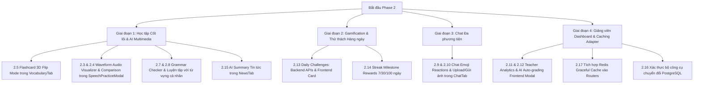

# Kế Hoạch Triển Khai: Phase 2 - Tính Năng Hoàn Chỉnh & Trải Nghiệm Premium

Kế hoạch này triển khai toàn bộ các tính năng còn thiếu của **Phase 2**, đưa hệ thống từ mức prototype lên mức **"sản phẩm thực tế hoàn chỉnh dùng hàng ngày"**.

---

## 🏗️ Phân Kỳ Triển Khai

---

## 📋 Chi Tiết Thay Đổi Mã Nguồn

### Giai đoạn 1: Học tập & AI Multimedia

#### 1. [VocabularyTab.tsx](file:///c:/Users/basduy05/Downloads/NCKHTA/frontend/app/dashboard/student/VocabularyTab.tsx)
- Bổ sung chế độ **Flashcard 3D Flip** (chuyển đổi qua lại giữa dạng Danh sách và Thẻ 3D).
- Hiệu ứng lật thẻ 3D (`perspective`, `transform-style: preserve-3d`, `rotateY(180deg)`).
- Đánh giá Spaced Repetition chuẩn Leitner: **Again (1 ngày)**, **Hard (3 ngày)**, **Good (7 ngày)**, **Easy (14 ngày)**.
- Phím tắt: Phím Space để lật thẻ, phím 1-4 để chấm điểm nhanh.
- Nút kích hoạt nhanh Web Push Notification ngay trong tab.

#### 2. [SpeechPracticeModal.tsx](file:///c:/Users/basduy05/Downloads/NCKHTA/frontend/app/dashboard/student/SpeechPracticeModal.tsx)
- Bổ sung **Realtime Waveform Visualizer Canvas** qua Web Audio API (`AudioContext` + `AnalyserNode`).
- Cho phép học viên nghe lại giọng đọc của chính mình so sánh trực quan với âm thanh mẫu chuẩn bản xứ.

#### 3. [GrammarTab.tsx](file:///c:/Users/basduy05/Downloads/NCKHTA/frontend/app/dashboard/student/GrammarTab.tsx)
- Bổ sung tab con **Kiểm tra Ngữ pháp AI (Grammar Checker)**:
  - Input nhập câu bất kỳ của học viên.
  - Phân tích lỗi sai chi tiết: Loại lỗi (Thì, Chia động từ, Giới từ, Dấu câu), vị trí sai, gợi ý sửa, giải thích tiếng Việt.
  - Câu viết lại mượt mà (natural rewrite).
- Bổ sung chế độ bài tập **"Luyện tập với từ vựng của tôi"**: Sử dụng trực tiếp danh sách từ học viên đã lưu để sinh câu hỏi ngữ pháp.

#### 4. [NewsTab.tsx](file:///c:/Users/basduy05/Downloads/NCKHTA/frontend/app/dashboard/student/NewsTab.tsx)
- Bổ sung nút **"✨ Tóm tắt nhanh với AI"** trong chế độ đọc bài báo.
- Gọi backend endpoint `/student/news/summary` để hiển thị modal/khung: 3 điểm chính cốt lõi (Key Takeaways) và bảng từ vựng quan trọng kèm cấp độ CEFR.

#### 5. [student.py](file:///c:/Users/basduy05/Downloads/NCKHTA/ai-service/app/routers/student.py)
- Bổ sung endpoint `POST /student/grammar/check` (Grammar Checker AI).
- Bổ sung endpoint `POST /student/news/summary` (AI Article Summary).
- Bổ sung endpoint `GET /student/vocabulary/for-grammar` (Lấy từ vựng để sinh bài tập).

---

### Giai đoạn 2: Gamification & Thử Thách Hàng Ngày

#### 1. [student.py](file:///c:/Users/basduy05/Downloads/NCKHTA/ai-service/app/routers/student.py)
- Bổ sung endpoint `GET /student/daily-challenges`: Lấy tiến độ 3 nhiệm vụ trong ngày (Tra 3 từ, Ôn 5 thẻ flashcard, Luyện 1 bài phát âm).
- Bổ sung endpoint `POST /student/daily-challenges/claim`: Nhận 50 điểm thưởng khi hoàn thành.
- Bổ sung endpoint `GET /student/streak-milestones`: Trạng thái các mốc 7 ngày, 30 ngày, 100 ngày.
- Bổ sung endpoint `POST /student/streak-milestones/claim`: Nhận thưởng milestone (+100, +500, +2000 pts).

#### 2. [OverviewTab.tsx](file:///c:/Users/basduy05/Downloads/NCKHTA/frontend/app/dashboard/student/OverviewTab.tsx)
- Thêm widget **Nhiệm vụ Hàng ngày (Daily Challenges)** với progress bar thời gian thực và nút nhận thưởng.

#### 3. [StreakCalendar.tsx](file:///c:/Users/basduy05/Downloads/NCKHTA/frontend/app/dashboard/student/StreakCalendar.tsx)
- Thêm phần hiển thị **Mốc phần thưởng Streak (7 / 30 / 100 ngày)** với huy hiệu động và nút "Nhận thưởng" khi đạt mốc.

---

### Giai đoạn 3: Chat Đa Phương Tiện

#### 1. [ChatTab.tsx](file:///c:/Users/basduy05/Downloads/NCKHTA/frontend/app/dashboard/student/ChatTab.tsx)
- Bổ sung thanh phản ứng biểu cảm (Emoji Picker Bar: ❤️, 👍, 😂, 😮, 😢) trên mỗi tin nhắn.
- Hiển thị badge reactions dưới chân tin nhắn cùng danh sách người đã thả biểu cảm.
- Bổ sung nút đính kèm và gửi ảnh (Image Picker / Clipboard Paste) kèm modal Lightbox phóng to xem ảnh.
- Đồng bộ các sự kiện `reaction` và `message_type: 'image'` qua WebSocket và REST fallback.

---

### Giai đoạn 4: Giảng Viên & Hạ Tầng Caching

#### 1. [teacher.py](file:///c:/Users/basduy05/Downloads/NCKHTA/ai-service/app/routers/teacher.py)
- Hợp nhất và tinh chỉnh router `/teacher/analytics/class/{class_id}` để cung cấp đầy đủ các chỉ số (tỉ lệ hoàn thành, phân phối điểm, học sinh cần hỗ trợ).

#### 2. [teacher/page.tsx](file:///c:/Users/basduy05/Downloads/NCKHTA/frontend/app/dashboard/teacher/page.tsx)
- Hoàn thiện giao diện chấm điểm bài nộp của giáo viên: Nút "AI Chấm điểm gợi ý" (`/teacher/submissions/{id}/ai-grade`), cho phép giáo viên chỉnh sửa điểm và phản hồi (`/teacher/submissions/{id}/review`).

#### 3. [cache_service.py](file:///c:/Users/basduy05/Downloads/NCKHTA/ai-service/app/services/cache_service.py) & Routers
- Tích hợp `cache_service` vào các endpoint tra từ điển và bảng xếp hạng để giảm tải cho database và API AI.

---

## 🧪 Kế Hoạch Kiểm Thử (Verification Plan)

### Kiểm thử tự động & backend
- Chạy lệnh kiểm tra cú pháp và khởi động FastAPI router:
  `python -m py_compile ai-service/app/routers/student.py ai-service/app/routers/teacher.py`
- Kiểm tra kết nối CacheService (In-Memory fallback & Redis).

### Kiểm thử frontend Next.js
- Chạy TypeScript build check hoặc Next.js lint:
  `npm run build` hoặc test component loading trong trình duyệt.

### Kiểm thử trải nghiệm giao diện người dùng
- Kiểm tra lật thẻ Flashcard 3D và phím tắt.
- Kiểm tra tính năng Grammar Checker với câu mẫu có lỗi sai.
- Kiểm tra gửi tin nhắn có emoji reaction và xem ảnh đính kèm.
- Kiểm tra nhận thưởng Daily Challenge và Streak Milestone.
