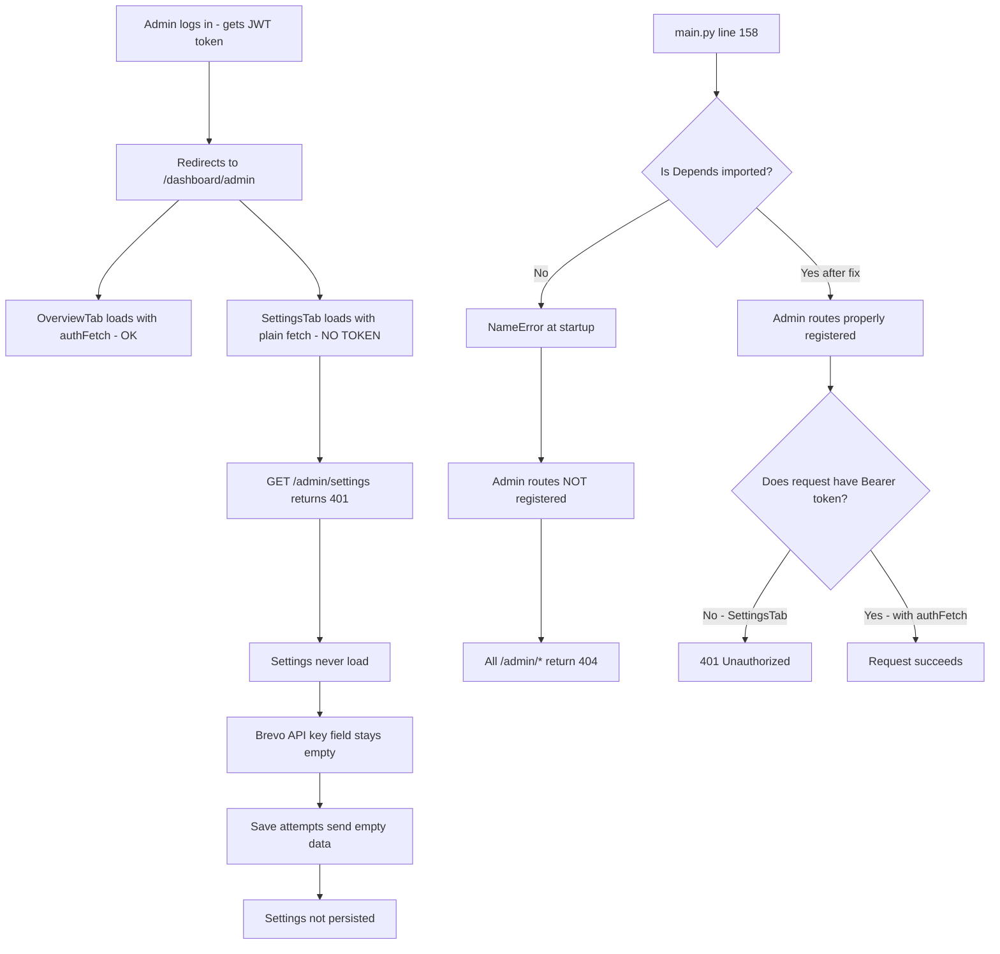
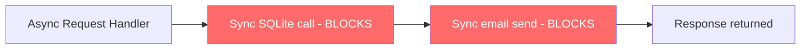
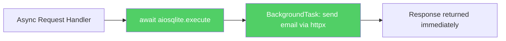
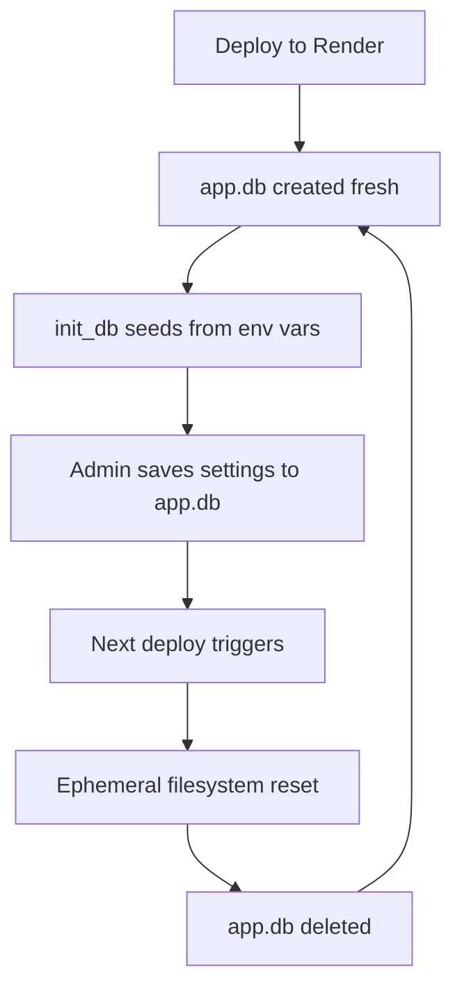

# 🔒 Security Upgrade & Async Optimization Plan

## Executive Summary

After a thorough audit of the EAM/iEdu codebase, I identified **3 CRITICAL bugs** that explain why Admin cannot connect to the backend, why Brevo API key settings are not being saved, and **15+ security/performance improvements** needed.

---

## 🚨 CRITICAL BUGS (Must Fix First)

### BUG 1: Missing `Depends` import in `main.py` — Admin routes broken

**File:** `ai-service/app/main.py` line 1 and line 158

**Problem:** `Depends` is NOT imported from FastAPI, but line 158 uses it:

```python
# Line 1 - NO Depends imported
from fastapi import FastAPI, UploadFile, File, Body, Request

# Line 158 - Depends is UNDEFINED
app.include_router(admin.router, dependencies=[Depends(get_admin_user)]) if admin else None
```

**Impact:** If the admin module loads successfully, calling `Depends(get_admin_user)` throws a `NameError` and the app crashes. If it crashes during router registration, admin routes are never registered → frontend gets 404 on all `/admin/*` calls.

**Fix:** Add `Depends` to the import:
```python
from fastapi import FastAPI, UploadFile, File, Body, Request, Depends
```

---

### BUG 2: SettingsTab missing auth token — Settings never load/save

**File:** `frontend/app/dashboard/admin/page.tsx` lines 848-899

**Problem:** The `SettingsTab` uses plain `fetch()` WITHOUT the Bearer token, while all `/admin/*` routes require authentication via `Depends(get_admin_user)`:

```typescript
// Line 850 — NO auth token!
const res = await fetch(`${API_URL}/admin/settings`);

// Line 861 — NO auth token!
const res = await fetch(`${API_URL}/admin/settings`, { method: 'PUT', ... });

// Line 880 — NO auth token!
const res = await fetch(`${API_URL}/admin/settings/test-email`, { method: 'POST' });

// Line 895 — NO auth token!
const res = await fetch(`${API_URL}/admin/settings/test-neo4j`, { method: 'POST' });
```

**Impact:** All settings API calls return 401/403. Settings never load, never save. This is why:
- Brevo API key is not saved
- All admin settings are lost
- Test email and test Neo4j buttons fail

**Fix:** Replace `fetch()` with `authFetch()` which includes the Bearer token. The `authFetch` helper already exists in the same file (line 9).

---

### BUG 3: `auth_service._get_setting()` does not exist

**File:** `ai-service/app/routers/admin.py` lines 507-546

**Problem:** The test-email endpoint calls `auth_service._get_setting(...)` but this function does NOT exist in `auth_service.py`. The `auth_service` module imports `get_setting` from `database.py` but never defines `_get_setting`.

```python
# admin.py line 507 — _get_setting NOT defined in auth_service!
provider = (auth_service._get_setting("EMAIL_PROVIDER") or "auto").lower().strip()
```

**Impact:** `POST /admin/settings/test-email` crashes with `AttributeError: module 'app.services.auth_service' has no attribute '_get_setting'`

**Fix:** Either:
- Add `_get_setting = get_setting` alias in `auth_service.py`, OR
- Change `admin.py` to use `get_setting` from `database.py` directly

---

## 🔍 Root Cause: Why Admin Cannot Connect



---

## 🔐 Security Issues Found

### Priority 1 - High Risk

| # | Issue | File | Line |
|---|-------|------|------|
| 1 | CORS wildcard `origins = ["*"]` allows any origin | `main.py` | 75 |
| 2 | JWT `SECRET_KEY` uses default value | `auth_service.py` | 20 |
| 3 | OTP has no time-based expiry | `auth.py` | register/verify |
| 4 | Reset token uses `random.choices` not cryptographically secure | `auth_service.py` | 78 |
| 5 | Java backend permits all without authentication | `SecurityConfig.java` | 19-20 |

### Priority 2 - Medium Risk

| # | Issue | File | Line |
|---|-------|------|------|
| 6 | No security headers - HSTS, CSP, X-Frame-Options | `main.py` | n/a |
| 7 | No token blacklisting for logout | `auth.py` | 122 |
| 8 | forgot-password/reset-password use raw query params not Pydantic | `auth.py` | 127,168 |
| 9 | Rate limiter is in-memory only - fails across multi-worker | `main.py` | 125-155 |
| 10 | No login attempt limiting - brute force possible | `auth.py` | 87 |

### Priority 3 - Low Risk

| # | Issue | Details |
|---|-------|---------|
| 11 | `datetime.utcnow()` is deprecated in Python 3.12+ | Use `datetime.now(UTC)` |
| 12 | No API versioning | Consider `/api/v1/` prefix |

---

## ⚡ Async/Performance Issues

### Current Problem: Blocking the Event Loop

All async route handlers in `auth.py`, `admin.py`, `student.py`, `teacher.py` perform synchronous operations:



### Specific Blocking Calls

| Location | Operation | Blocking Duration |
|----------|-----------|-------------------|
| `auth.py` register | SQLite INSERT + `send_otp_email` | ~2-15s email |
| `auth.py` verify-otp | SQLite UPDATE + `send_welcome_email` | ~2-15s email |
| `auth_service.py` `send_email()` | `urllib.request.urlopen` with 15s timeout | Up to 15s |
| `auth_service.py` `_send_via_smtp()` | `smtplib.SMTP` with 15s timeout | Up to 15s |
| `graph_service.py` all operations | `Neo4jGraph.query()` | ~100ms-5s |
| `database.py` `get_db()` | `libsql.connect()` + `conn.sync()` | ~500ms-3s for Turso |

### Proposed Async Architecture



---

## 💾 Settings Persistence Problem

### Current Flow on Render



### Problem
1. Render free tier uses **ephemeral filesystem** — `app.db` is deleted on every deploy
2. `init_db()` seeds settings from env vars, but `BREVO_API_KEY` and `EMAIL_PROVIDER` are NOT in `render.yaml`
3. Settings saved via admin panel go to local SQLite → lost on redeploy

### Solution
1. **Add all email settings to `render.yaml` env vars** so they survive deploys
2. **Use Turso external DB** for settings if already configured, so settings are never lost
3. **Add BREVO_API_KEY, EMAIL_PROVIDER, SENDER_NAME, FRONTEND_URL** to the `env_keys` list in `init_db()`

---

## 📋 Implementation Plan - Ordered by Priority

### Phase 1: Fix Critical Bugs (Immediate)

1. **Add `Depends` import to `main.py`** — One-line fix
2. **Add auth token to SettingsTab** — Replace 4x `fetch()` with `authFetch()` calls
3. **Add `_get_setting` to `auth_service.py`** — Add function alias or fix import in `admin.py`

### Phase 2: Security Hardening

4. **Restrict CORS origins** — Replace `["*"]` with actual frontend URLs
5. **Add SECRET_KEY to render.yaml** — Generate with `python -c "import secrets; print(secrets.token_urlsafe(64))"`
6. **Add OTP expiry** — Add `otp_expires` column to users table, check during verification
7. **Use `secrets.token_urlsafe()`** — Replace `random.choices` for reset tokens
8. **Add Pydantic models** for forgot-password and reset-password endpoints
9. **Add security headers middleware** — HSTS, X-Frame-Options, X-Content-Type-Options, CSP
10. **Add login attempt rate limiting** — Track failed attempts per email

### Phase 3: Async & Performance

11. **Convert email sending to async** — Use `httpx.AsyncClient` instead of `urllib.request`
12. **Use FastAPI BackgroundTasks** for email sending — Return response immediately, send email in background
13. **Wrap sync DB operations** — Use `asyncio.to_thread()` for SQLite calls or migrate to `aiosqlite`
14. **Wrap Neo4j calls** with `asyncio.to_thread()` for truly non-blocking execution

### Phase 4: Settings Persistence

15. **Add missing env vars to render.yaml** — BREVO_API_KEY, EMAIL_PROVIDER, SENDER_NAME, FRONTEND_URL, SECRET_KEY
16. **Ensure init_db seeds all email keys** — Update `env_keys` list in `database.py`
17. **Prioritize Turso for settings** — If Turso is configured, settings survive deploys automatically

### Phase 5: Java Backend Security (If Active)

18. **Add JWT token validation** to Spring Security
19. **Add authentication filter** for API endpoints
20. **Add proper CORS configuration** with allowed origins

---

## 🔧 Quick Reference: Files to Modify

| File | Changes Needed |
|------|---------------|
| `ai-service/app/main.py` | Add `Depends` import, restrict CORS, add security headers middleware |
| `frontend/app/dashboard/admin/page.tsx` | Use `authFetch` in SettingsTab for all API calls |
| `ai-service/app/services/auth_service.py` | Add `_get_setting`, use `secrets` module, add OTP expiry logic |
| `ai-service/app/routers/auth.py` | Add Pydantic models, OTP expiry check, login rate limiting, use BackgroundTasks for email |
| `ai-service/app/routers/admin.py` | Fix `_get_setting` references |
| `ai-service/app/database.py` | Add `otp_expires` column migration, update `env_keys` list |
| `render.yaml` | Add BREVO_API_KEY, EMAIL_PROVIDER, SECRET_KEY, FRONTEND_URL env vars |
| `backend-core/.../SecurityConfig.java` | Add JWT filter, proper auth config |
