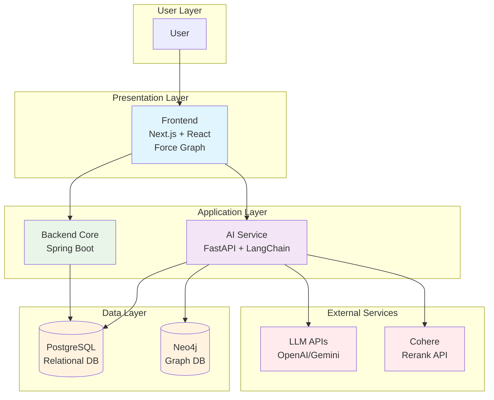
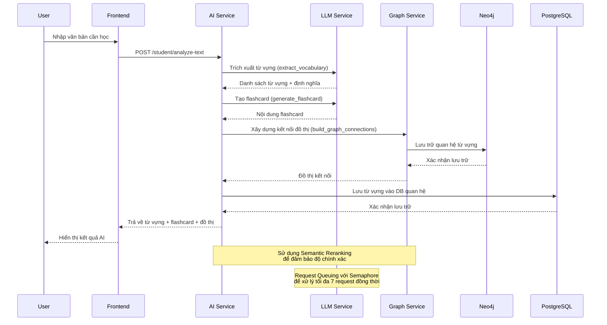
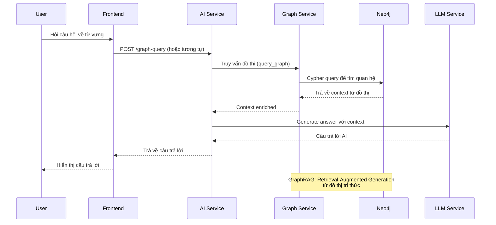
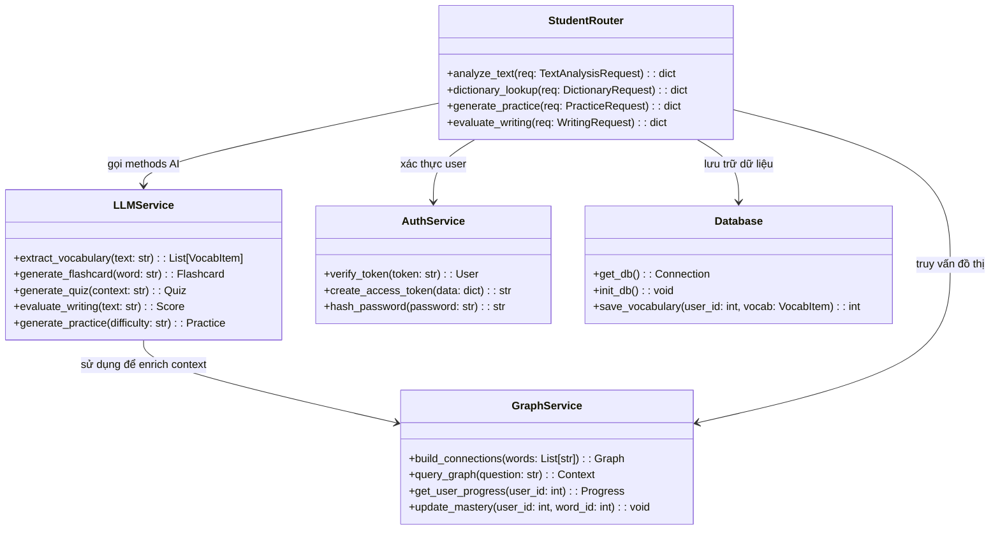

# Sơ đồ Kiến trúc và Luồng AI của Hệ thống EAM

## Tổng quan Hệ thống

Hệ thống EAM (Educational AI Management) là một nền tảng học tập tiếng Anh thông minh sử dụng Đồ thị Tri thức (Knowledge Graph) và Trí tuệ Nhân tạo (AI) để tạo trải nghiệm học tập cá nhân hóa. Hệ thống bao gồm ba thành phần chính:

1. **Frontend**: Giao diện người dùng được xây dựng bằng Next.js với React Force Graph để trực quan hóa đồ thị kiến thức.
2. **AI Service**: Dịch vụ AI chính sử dụng FastAPI, LangChain và Neo4j để xử lý các tác vụ AI như trích xuất từ vựng, tạo flashcard, và chatbot.
3. **Backend Core**: Dịch vụ backend chính sử dụng Spring Boot để quản lý người dùng, tiến độ học tập và logic nghiệp vụ.
4. **Databases**: PostgreSQL cho dữ liệu quan hệ và Neo4j cho đồ thị tri thức.

## Sơ đồ Kiến trúc Hệ thống (UML Component Diagram)

### Chi tiết Các Thành phần

#### Frontend (Next.js)
- **Công nghệ**: Next.js 14, React, TailwindCSS, Three.js/React-Force-Graph
- **Chức năng chính**:
  - Giao diện người dùng cho học sinh, giáo viên và admin
  - Trực quan hóa đồ thị kiến thức 3D
  - Xử lý tương tác người dùng (nhập văn bản, upload file)
  - Hiển thị flashcard, quiz, và kết quả AI

#### AI Service (FastAPI)
- **Công nghệ**: Python FastAPI, LangChain, Pydantic
- **Chức năng chính**:
  - Trích xuất từ vựng từ văn bản (`POST /student/analyze-text`)
  - Tra cứu từ điển với AI (`POST /student/dictionary/lookup`)
  - Tạo bài tập thực hành (`POST /student/practice/generate`)
  - Đánh giá bài viết (`POST /student/writing/evaluate`)
  - Phát âm IPA (`POST /student/ipa/generate`)
  - Upload và phân tích file (`POST /student/file/upload-analyze`)
  - Truy vấn đồ thị kiến thức (`GET /student/knowledge-graph`)

#### Backend Core (Spring Boot)
- **Công nghệ**: Java Spring Boot, Maven
- **Chức năng chính**:
  - Quản lý người dùng và xác thực JWT
  - Quản lý lớp học và bài tập
  - Tính toán tiến độ học tập và Spaced Repetition
  - Lưu trữ kết quả quiz và điểm số

#### Databases
- **PostgreSQL**: Lưu trữ dữ liệu quan hệ (người dùng, lớp học, bài tập, kết quả)
- **Neo4j**: Lưu trữ đồ thị tri thức (quan hệ giữa từ vựng, khái niệm)

## Sơ đồ Luồng AI (UML Sequence Diagram)

Dưới đây là sơ đồ luồng cho quá trình trích xuất và học từ vựng từ văn bản, một trong những tính năng AI cốt lõi của hệ thống.

### Chi tiết Luồng AI

1. **Nhập liệu**: Người dùng nhập văn bản vào giao diện frontend
2. **Gửi yêu cầu**: Frontend gửi POST request đến AI Service endpoint `/student/analyze-text`
3. **Xử lý AI**:
   - **Trích xuất từ vựng**: LLM phân tích văn bản, lọc ra từ vựng quan trọng theo cấp độ CEFR
   - **Tạo flashcard**: Tự động tạo nội dung flashcard với ví dụ, hình ảnh minh họa
   - **Xây dựng đồ thị**: Tạo kết nối giữa các từ vựng trong Neo4j
4. **Lưu trữ**: Lưu từ vựng vào PostgreSQL và quan hệ vào Neo4j
5. **Trả kết quả**: Trả về dữ liệu cho frontend hiển thị

## Sơ đồ Luồng Chatbot AI (GraphRAG)

### Tính năng Nâng cao trong Luồng AI

- **Request Queuing**: Sử dụng Semaphore để giới hạn 7 request đồng thời, đảm bảo ổn định hệ thống
- **Semantic Reranking**: Sử dụng Cohere Rerank v3.0 để sắp xếp lại kết quả theo độ liên quan
- **Unicode Integrity**: Đảm bảo hiển thị đúng ký tự đặc biệt tiếng Việt
- **Caching**: Cache kết quả AI để tăng tốc độ phản hồi

## Sơ đồ Lớp (UML Class Diagram) cho AI Service

## Kết luận

Các sơ đồ trên mô tả chi tiết kiến trúc và luồng hoạt động của hệ thống EAM, tập trung vào việc sử dụng AI và đồ thị tri thức để tạo trải nghiệm học tập cá nhân hóa. Hệ thống được thiết kế để mở rộng và có thể tích hợp thêm các tính năng AI mới như đánh giá phát âm, tạo hình ảnh minh họa, và gamification.